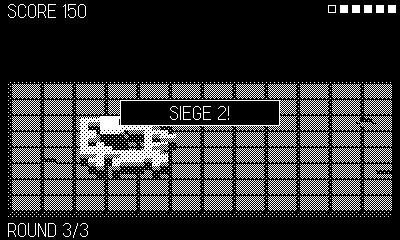

# Bulwark

Rampart in a voxel room. Wall in your keep with tetromino pieces, then
survive the siege: catapults on the east ridge lob shells that blast real
craters in your defenses, while you answer with the keep cannon. Between
sieges you rebuild — if the flood-fill finds a gap in your ring when the
build timer runs out, the game is over.

## Controls

**Build phase** — **d-pad** moves the cursor, **crank** turns the piece
(90° detents; B also turns), **A** places.

**Siege phase** — **crank** aims the keep cannon, **hold A** to run the
power meter, **release A** to fire.

## Rules

- Your wall ring must fully enclose the keep when each build phase ends —
  WALLS OPEN means defeat.
- The keep has six hearts; shells landing near it (including your own)
  cost one each. CASTLE FELL means defeat.
- Destroyed catapults pay 25 pts; a closed ring pays 50. Killing every
  catapult ends the siege early.
- Survive three sieges for VICTORY. Each siege brings more catapults,
  and craters make rebuilding harder every round.
