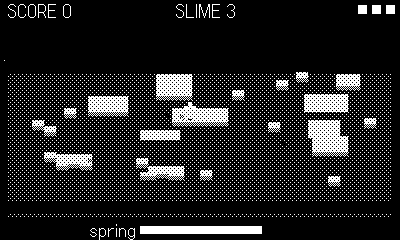

# Crumble

Height-survival on crumbling ground. Slime rises from the floor of the
room, level by level, swallowing the landscape; the columns you climb
crumble away under your feet. Stay high, grab gems, and wind the crank —
a charged spring jump is the only way up when the easy routes are gone.

## Controls

- **d-pad** — move (walks up 1-voxel steps automatically)
- **B** — hop (clears ~2 voxels)
- **crank** — wind the spring (meter at the bottom)
- **A** — release the spring jump (uncharged: plain hop)

## Rules

- Touching slime burns a heart (it pops you upward — use it); three burns
  and you're consumed.
- Gems are worth 10 pts and respawn on high ground.
- Standing still is not a plan: the column under you loses a voxel every
  half-second, and the slime rises faster as the game goes on.
- Dug-out pits below the slime line flood on the next rise.
