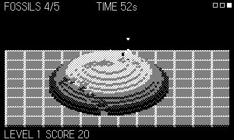

# Excavate

Voxel archaeology. Fossils are buried in the deep strata of a great
mound — walk its slopes, sink shafts, tunnel along the dark layers, and
get them out before the shift ends. Rock with nothing under it falls:
undermine a fossil and it drops to your tunnel floor, but tunnel greedily
and the roof drops on you instead.

## Controls

- **d-pad** — move (climbs gentle slopes; squeeze through your tunnels)
- **crank** — aim the pick
- **A** — dig: into a face it tunnels, on open ground it sinks a pit
- **B** — hop

## Rules

- Extract fossils by standing beside them: intact is 15 pts; one your
  pick has clipped is cracked, worth 5.
- Cave-ins near you cost a heart; three and you're buried. The bouncing
  chevron always marks you, even deep underground.
- Collect every fossil before the shift timer for a new, richer mound.
