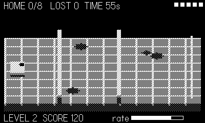

# Herd

A pocket Lemmings. Sheep pour from the west platform and march east
toward the gate, streaming around whatever blocks them: ridges stop them
cold, goo pools spook them into detours, and long falls end them. You
can't build anything — your only tools remove terrain. Dig notches into
walls until they're stairs, blast whole gaps through ridges, or carve the
surface off a goo pool to drain a path straight through it.

## Controls

- **d-pad** — move the cursor
- **A** — dig (small carve, repeats while held)
- **B** — blast (big carve, limited charges — and it kills sheep caught
  in it)
- **crank** — the release-rate dial: wind it up to pour sheep out faster,
  down to trickle them while you prepare the route

## Rules

- Save the quota (out of 12 sheep) before the timer runs out; miss it and
  the flock is lost.
- Level 1's ridge has a gap. Later ridges don't — spend your blasts well.
- Craters, drained goo and dug stairs persist for the whole level: the
  route you carve is the route they walk.
