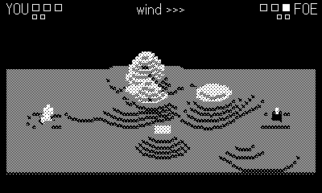

# Lob

A turn-based artillery duel in a voxel room — Worms in a bottle. Two
mortars trade shells over a ridge of rolling hills; every miss blasts a
crater, and by the last round the battlefield you started with has been
lobbed into a moonscape. The foe brackets its aim tighter with every
shot, so finish it before it finds you.

## Controls

- **crank** — rotate your aim (the dotted line); d-pad ← → if docked
- **hold A** — run the power meter (it sweeps up and back down)
- **release A** — fire at whatever the meter reads

## Rules

- Shells fly a fixed 45° lob bent by the wind (gauge at the top) — watch
  it every turn, it changes.
- Blast within the burst radius costs a heart; a direct hit costs two.
  Yes, you can hurt yourself.
- Craters are real: dig the ground out from under the foe and it drops.
- Three hearts a round; first to two round wins takes the match.
