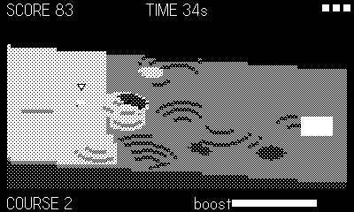

# Marble

Marble Madness on a voxel heightfield. Roll from the high west pad down
to the white east pad before the clock dies: slopes accelerate you,
steep faces bounce you, crests throw you airborne, and the goo pools
drink marbles. Three marbles per run; courses keep coming, each bumpier
and gooier than the last.

## Controls

- **d-pad** — steer (weaker in the air)
- **crank** — wind the boost meter
- **A** — release the boost along your line of motion

## Rules

- Reaching the pad scores 25 plus double the seconds you had left.
- Goo costs a marble; lose all three and the run is over.
- Momentum is the game: line up valleys, hop crests, and save the boost
  for climbs out of dips.
