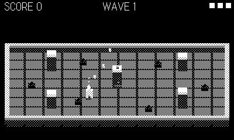

# Rubble

A Voxatron-style destructible voxel arena. Waves of grubs burrow in from
the edges and converge on you; every stray shot — yours or their chewing —
carves real holes in the terrain. By wave five the arena you started with
is rubble.

## Controls

- **d-pad** — move
- **crank** — aim (docked: aim follows your movement)
- **A** — fire (hold for autofire)
- **B** — jump (hop onto mounds, over craters)

## Rules

- Grubs deal contact damage; three hits and you're wrecked.
- Shots one-shot grubs (10 pts) and blast craters in walls, pillars and
  mounds. Clearing a wave pays 25 pts and summons a bigger, faster one.
- Blocked grubs chew through cover — no hiding behind a pillar forever.
- The floor is bedrock; everything above it is destructible.
