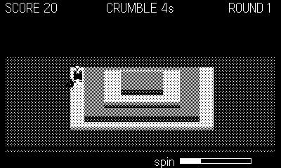

# Summit

Sumo on a crumbling ziggurat. Brutes swarm the terraces of a stepped
pyramid above a goo sea; anyone who lands in the goo is gone. The
terrace steps are two voxels tall, so only you can jump between levels —
brutes have to be knocked off them, level by level, until the sea takes
them. Meanwhile the lowest terrace erodes away on a timer, and the arena
shrinks under everyone's feet.

## Controls

- **d-pad** — move
- **A** — shove (short-range, in your facing direction)
- **crank** — wind the spin meter; at full charge the next **A** is a
  radial blast that launches everything near you
- **B** — jump up a terrace

## Rules

- Knocked-out brutes score 10; clearing a round scores 25 and brings a
  bigger, faster crowd.
- Brutes shove back. One touch of the goo ends your run.
- Watch the CRUMBLE timer — high ground is the only ground that lasts.
