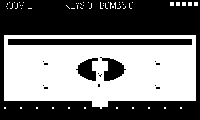

# Vault

A dungeon crawl where the dungeon is made of real voxels. Five rooms
stand between you and the idol: grubs, goo moats, jumpable parapets, a
locked door and the key that opens it — and because every wall is just
voxels, a bomb opens anything. Your run saves at every doorway; continue
it from the title screen.

## Controls

- **d-pad** — move
- **crank** — aim the sword (docked: follows movement)
- **A** — swing (kills grubs, smashes pots)
- **B** — drop a bomb (careful: it hurts you too)
- **B on the title screen** — continue a saved run

## Rules

- Pots drop hearts and bombs. Keys open the doors they were hidden for —
  or spend a bomb and make your own door.
- Goo burns a heart per touch; grubs bite. Five hearts, then SLAIN.
- Touch the idol in the far room to win the vault.
