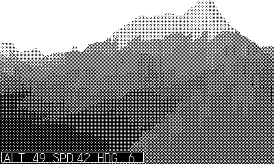

# Voxelspace

A tech demo, not a game: the classic **VoxelSpace** terrain renderer
(NovaLogic's *Comanche*, 1992 — see
[s-macke/VoxelSpace](https://github.com/s-macke/VoxelSpace)) running on
the Playdate's 1-bit screen. Endless free flight over procedurally
generated wrapping terrain — mountains, lakes, snowcaps, and haze that
fades distant ridges toward the sky.

## Controls

| Input | Action |
| --- | --- |
| Crank / ◀ ▶ | steer |
| ▲ ▼ | climb / dive |
| Ⓐ (hold) | boost |
| Ⓑ | generate new terrain |

## How it works

Unlike the other entries this doesn't use the Vox room engine. The world
is a wrapping 256x256 heightmap (four octaves of bilinear value noise,
packed as `height*32 + shade` in one flat array). Each frame the renderer
casts one ray per 2px screen column, marching the 90° frustum front to
back with depth steps that grow ~6% per iteration (built-in level of
detail) and drawing only slices that rise above everything already
drawn. Speed comes from the classic tricks: precomputed z / projection /
fog ladders, per-ray early exit once nothing farther could clear the
column's y-buffer (bounded by the map's max height), and merging
adjacent same-shade slices into single fills. Shades are a 17-level
Bayer dither ramp — dark water, land banded by height and lit by slope
(light from the west), pale snowcaps — fog lifts shades toward the sky
in four steps and flattens the far field to one shade. ~5 ms/frame in
the Simulator, so the demo runs at the Playdate's max 50 fps refresh.
